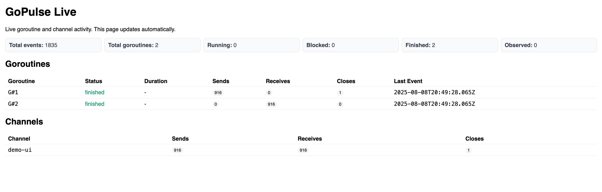

# GoPulse — Goroutine Visualizer & Debugger

[](https://pkg.go.dev/github.com/cploutarchou/GoPulse)
[](https://opensource.org/licenses/MIT)

A modern toolkit for visualizing, tracing, and debugging goroutine lifecycles and channel usage in Go applications.

- **Visualize** goroutine lifecycles and channel operations in real-time
- **Trace** blocking, leaks, deadlocks, and contention with minimal overhead  
- **Debug** complex concurrency issues with interactive tools (CLI + web UI)
- **Zero dependencies** and easy to instrument existing code

## Table of Contents

- [Screenshot](#screenshot)
- [Quick Start](#quick-start)
- [Installation](#installation)
- [Basic Usage](#basic-usage)
- [Configuration](#configuration)
- [CLI Commands](#cli-commands)
- [Web UI](#web-ui)
- [In-App Live UI](#in-app-live-ui)
- [Examples](#examples)
- [Environment Variables](#environment-variables)
- [Cross-Compilation](#cross-compilation)
- [Troubleshooting](#troubleshooting)
- [Compatibility](#compatibility)
- [Roadmap](#roadmap)
- [Contributing](#contributing)
- [License](#license)

## Screenshot



A live snapshot of the in-app UI showing goroutine states, channel activity, and performance summaries.

## Quick Start

Get up and running in under 30 seconds:
```go
package main

import (
	"context"
	"time"

	"github.com/cploutarchou/gopulse/trace"
)

func main() {
	// Start tracing
	_ = trace.Start(trace.Config{Output: "stdout"})
	defer trace.Stop()
	// Start live UI server
	stop, _ := trace.UI(":8080")
	defer stop(context.Background())

	// Your concurrent code here...
	ch := trace.NewChan[int](0, "demo")
	trace.Go(func() {
		defer ch.Close()
		for i := 0; i < 10; i++ {
			ch.Send(i)
			time.Sleep(100 * time.Millisecond)
		}
	})

	trace.Go(func() {
		for v, ok := ch.Recv(); ok; v, ok = ch.Recv() {
			_ = v // process value
		}
	})

	// Open http://localhost:8080 to see live activity
	time.Sleep(2 * time.Second)
}
``` 

## Installation

**Requirements:** Go 1.24+ (Go 1.20+ supported)

Install the CLI tool:

```bash 
  go install github.com/cploutarchou/GoPulse/cmd/gopulse@latest
```
Or pin to a specific version:
```bash
  go install github.com/cploutarchou/GoPulse/cmd/gopulse@v1.0.0
```
Add the library to your project:
```bash
  go get github.com/cploutarchou/GoPulse
```
## Basic Usage
### 1. Instrument Your Code
Import and initialize tracing in your application:
```go
import "github.com/cploutarchou/GoPulse/trace"

func main() {
    // Start tracing to stdout (or specify a file path)
    _ = trace.Start(trace.Config{Output: "stdout"})
    defer trace.Stop()

    // Your application code...
}
```
### 2. Instrument Goroutines and Channels
Use `trace.Go()` for goroutines and `trace.NewChan()` for channels:
```go
// Traced goroutines
trace.Go(func() {
    // goroutine work
})

// Traced channels
ch := trace.NewChan[string](10, "worker-queue")
ch.Send("message")
value, ok := ch.Recv()
ch.Close()

// Blocking operations
unblock := trace.Block("database query")
result := database.Query("SELECT ...")
unblock()
```
### 3. Collect Events
Run your application and collect trace events:
```bash
    # Output to file
    go run your-app.go > events.log
    
    # Or configure file output in code
    _ = trace.Start(trace.Config{Output: "trace.log"})
```
**Sample JSON event:**
```json
{"time":"2025-01-01T12:00:00Z","type":"g_start","gid":42,"details":{"real_gid":123}}
```
## Configuration
### trace.Config Options
```go
type Config struct {
    // Output destination: "stdout", "-", or file path
    Output string
    // Enable block/unblock event sampling (default: true)
    SampleBlocks bool
}

// Examples
_ = trace.Start(trace.Config{
    Output: "/tmp/myapp-trace.log",
    SampleBlocks: true,
})
```
### Event Types
- / - Goroutine lifecycle `g_start``g_stop`
- / / - Channel operations `c_send``c_recv``c_close`
- `block` / - Blocking points `unblock`
- - Potential deadlock detection `deadlock_hint`

## CLI Commands
### Analyze Events
```bash
    # Basic analysis and leak detection
    gopulse analyze events.log
    
    # Get help
    gopulse analyze --help
```
**Output example:**
``` 
Found 3 goroutines in log

G#1: 2025-01-01T12:00:00Z -> 2025-01-01T12:00:01Z (finished)
  - 2025-01-01T12:00:00Z g_start
  - 2025-01-01T12:00:00Z c_send chan=demo
  - 2025-01-01T12:00:01Z g_stop

Potential leaks (goroutines without stop): 0
```
### Web Visualization
```bash
    # Static view (refresh to reload)
    gopulse web events.log -addr :8080
    
    # Live streaming view (auto-updates)
    gopulse web events.log -addr :8080 -live
    
    # Custom address
    gopulse web events.log -addr localhost:3000 -live
```
**Web UI features:**
- **Static mode**: Timeline visualization with refresh-to-reload
- **Live mode**: Real-time table view with SSE streaming
- Goroutine status tracking (running/blocked/finished)
- Channel operation counters
- Automatic deadlock hints

## Web UI
### Static Timeline View
- Visual timeline of goroutine lifecycles
- Channel event annotations
- Manual refresh to reload data
- Ideal for post-mortem analysis

### Live Dashboard
- Real-time goroutine status table
- Channel activity counters
- Automatic updates via Server-Sent Events
- Deadlock detection alerts
- Summary statistics

Access at after starting the web server. `http://localhost:8080`
## In-App Live UI
Embed a live web UI directly in your application:
```go
import (
    "context"
    "github.com/cploutarchou/GoPulse/trace"
)

func main() {
    // Start tracing
    _ = trace.Start(trace.Config{Output: "stdout"})
    defer trace.Stop()

    // Start embedded web server
    stop, err := trace.UI(":8080")
    if err != nil {
        log.Fatal(err)
    }
    defer stop(context.Background())

    // Your application logic...
    
    // UI will be available at http://localhost:8080
    select {} // keep alive
}
```
**Benefits:**
- No external log files required
- Real-time streaming from memory
- Zero-configuration setup
- Production-safe with low overhead

## Examples
The project includes several complete examples:
### UI Example (Embedded Web UI)
```bash
    go run ./examples/ui
    # Open http://localhost:8080
```
### CLI Example (File-based Analysis)
```bash
    go run ./examples/cli > events.log
    gopulse analyze events.log
    gopulse web -addr :8080 -live events.log
    # Open http://localhost:8080
```
### Advanced Instrumentation
```go
// Custom channel names for easier debugging
userQueue := trace.NewChan[User](100, "user-processing-queue")
resultChan := trace.NewChan[Result](0, "results")

// Named blocking operations
unblock := trace.Block("external API call")
response := httpClient.Get("https://api.example.com")
unblock()

// Traced goroutine pools
for i := 0; i < 10; i++ {
    trace.Go(func() {
        for user := range userQueue.Raw() {
            result := processUser(user)
            resultChan.Send(result)
        }
    })
}
```
## Environment Variables
Configure GoPulse behavior via environment variables:
```bash
    # Default output destination  
    export GOPULSE_OUTPUT=stdout              # or file path
    export GOPULSE_OUTPUT=/tmp/app-trace.log
    
    # Enable runtime/trace integration (experimental)
    export GOPULSE_RUNTIME_TRACE=1
    
    # Enable deadlock watchdog (emits hints after 5s of inactivity)
    export GOPULSE_DETECT_DEADLOCK=1
```
## Cross-Compilation
GoPulse builds standalone binaries with no CGO dependencies:
```bash
    # Linux AMD64
    GOOS=linux GOARCH=amd64 go build -o dist/gopulse-linux-amd64 ./cmd/gopulse
    
    # Linux ARM64  
    GOOS=linux GOARCH=arm64 go build -o dist/gopulse-linux-arm64 ./cmd/gopulse
    
    # macOS Intel
    GOOS=darwin GOARCH=amd64 go build -o dist/gopulse-darwin-amd64 ./cmd/gopulse
    
    # macOS Apple Silicon
    GOOS=darwin GOARCH=arm64 go build -o dist/gopulse-darwin-arm64 ./cmd/gopulse
    
    # Windows AMD64
    GOOS=windows GOARCH=amd64 go build -o dist/gopulse-windows-amd64.exe ./cmd/gopulse
    
    # Windows ARM64
    GOOS=windows GOARCH=arm64 go build -o dist/gopulse-windows-arm64.exe ./cmd/gopulse

```
For maximum compatibility, explicitly disable CGO:
```bash
  CGO_ENABLED=0 GOOS=linux GOARCH=amd64 go build -o gopulse-linux ./cmd/gopulse
```
## Troubleshooting
### Common Issues
**No events appearing:**
- Verify `trace.Start()` is called before any traced operations
- Check output destination (stdout vs file permissions)
- Ensure is executed `defer trace.Stop()`

**Web UI shows empty/stale data:**
- For live mode, verify the log file is being actively written
- Check file permissions for the events log
- Try refreshing the browser (static mode)

**Port conflicts:**
- Change the flag: `gopulse web -addr :9090 events.log` `-addr`
- For in-app UI: `trace.UI(":9090")`

**High overhead concerns:**
- GoPulse is designed for low overhead (~1-5% in typical workloads)
- Disable runtime integration: unset `GOPULSE_RUNTIME_TRACE`
- Use file output instead of stdout in production

**Permission errors:**
```bash
    # Ensure write permissions for output directory
    mkdir -p logs && chmod 755 logs
    export GOPULSE_OUTPUT=logs/trace.log
```
### Performance Impact
GoPulse is designed for production use with minimal overhead:
- **CPU impact:** ~1-3% in typical concurrent workloads
- **Memory impact:** Small fixed overhead + event buffer (~1MB)
- **I/O impact:** Asynchronous JSON writes, buffered output
- **No telemetry:** All data stays local

## Compatibility

| Go Version | Status | Notes |
| --- | --- | --- |
| 1.24+ | ✅ Recommended | Full feature support |
| 1.23 | ✅ Supported | All features work |
| 1.22 | ✅ Supported | All features work |
| 1.21 | ✅ Supported | All features work |
| 1.20 | ⚠️ Limited | Basic features only |
| <1.20 | ❌ Not supported | Use Go 1.20+ |
**Platform support:**
- ✅ Linux (AMD64, ARM64)
- ✅ macOS (Intel, Apple Silicon)
- ✅ Windows (AMD64, ARM64)
- ✅ FreeBSD, OpenBSD (community tested)

## Roadmap
### Completed ✅
- Goroutine start/stop tracing
- Channel send/receive/close tracing
- Basic deadlock and leak detection
- CLI analysis and web visualization
- In-app live UI server
- Cross-platform builds

### In Progress 🚧
- Enhanced deadlock detection algorithms
- Performance profiling integration
- Goroutine stack trace capture

### Planned 📋
- Rich interactive web UI with graphs and filtering
- VS Code extension for trace visualization
- Delve debugger integration
- Trace diff and comparison tools
- Export to OpenTelemetry format
- Integration with popular observability platforms

## Contributing
Contributions are welcome! Here's how to get started:
1. **Fork** the repository
2. a feature branch: `git checkout -b feature/amazing-feature` **Create**
3. **Make** your changes and add tests
4. **Run** tests: `go test ./...`
5. **Commit** changes: `git commit -m 'Add amazing feature'`
6. **Push** to branch: `git push origin feature/amazing-feature`
7. a Pull Request **Open**

### Development Setup
```bash
    git clone https://github.com/cploutarchou/gopulse.git
    cd GoPulse
    go mod tidy
    go test ./...
```
### Reporting Issues
Please use GitHub Issues for:
- 🐛 Bug reports
- 💡 Feature requests
- 📖 Documentation improvements
- ❓ Usage questions

## License
MIT License - see [LICENSE](LICENSE) file for details.
Copyright (c) 2025 Christos Ploutarchou

**Star ⭐ this repo if GoPulse helps you debug concurrent Go applications!**

